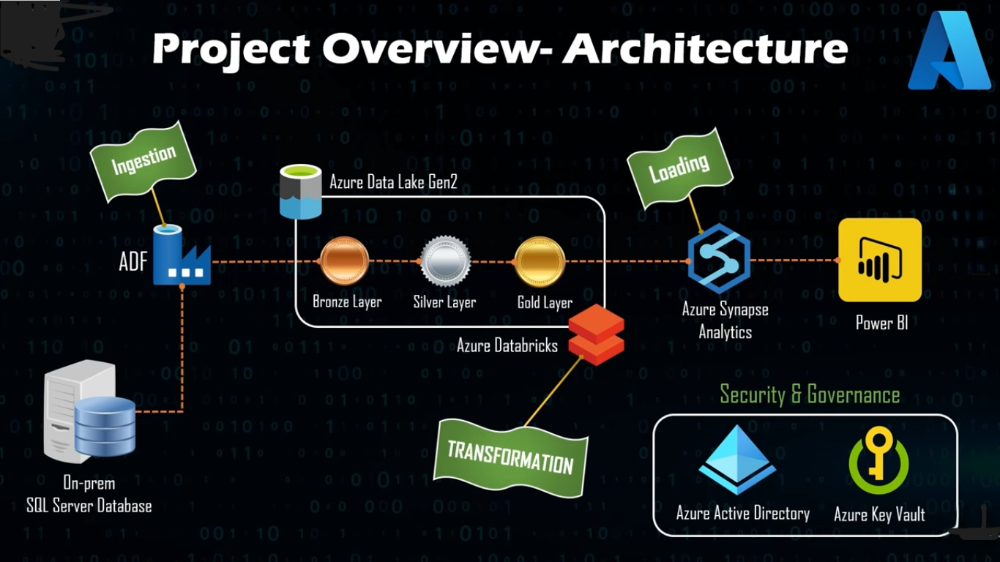

# End-to-End-Azure-Data-Engineering-Project 1

## Introduction 
A complete End to End Azure Data Engineering Project. In this project I am  going to create an end to end data platform right from Data Ingestion, Data Transformation, Data Loading and Reporting. 

The use case for this project is building an end to end solution by ingesting the tables from on-premise SQL Server database using Azure Data Factory and then store the data in Azure Data Lake. Then Azure databricks is used to transform the RAW data to the most cleanest form of data and then using Azure Synapse Analytics to load the clean data and finally using Microsoft Power BI to integrate with Azure synapse analytics to build an interactive dashboard.

## Architecture

## Technology Used
The tools that are covered in this project are,

1. Azure Data Factory
2. Azure Data Lake Storage Gen2
3. Azure Databricks
4. Azure Synapse Analytics
5. Azure Key vault
6. Azure Active Directory (AAD) and
7. Microsoft Power BI
 
https://github.com/bharrr/End-to-End-Azure-Data-Engineering-Project/assets/77478828/f6637253-3470-4cc8-9d2c-8771a52c4442

